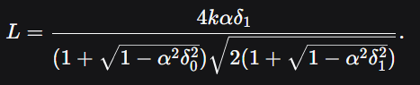
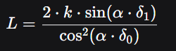

# HLL AT 射角辅助工具

## 简介

HLL里面，除了对AT老手外，AT的射角判断，对任何人，尤其是萌新都很困难。  
只是依靠固定点位的标尺，在实际操作中非常吃熟练度（分享标尺的玩家往往不用标尺也有丰富经验，也能打得准）。  
所以做了一个可以根据鼠标上抬dpi量计算距离的小工具。

## 一、原理概述

鼠标移动通常线性地转换为视角旋转。假设鼠标垂直移动 `d` 个计数（DPI），对应视角垂直变化 `θ = k⋅d` 弧度，  
其中 `k` 是游戏灵敏度相关的比例系数。  
若精准射角切线与目标距离交点到地面的高度为 `H`（未知），则目标距离 `D` 满足：  

`tan(θ) = H / D`

因此，只要知道 `k` 和 `H`，就能通过测量鼠标垂直移动 `d` 计算出距离 `D = H / tan(k⋅d)`。

通过两组已知距离 `D1, D2` 和对应鼠标移动 `d1, d2`，  
可以联立方程，并数值求解该方程得到 `k`，再代入求得 `H`。  
之后，只需测量任意目标的 `d` 即可实时计算 `D`。

由于得不到角度数据，所以最开始是这么想的……

但在训练空间里面注意到，房屋的屋顶延申面与地面夹角，正好近似是45°，  
而45°是火炮最大射程的射角。  
房屋正东西朝向，利用光直线传播，确定精准发射角度；用管理模式追上炮弹，找到落点，发现射程大致为1000m，  
因而获得一组参数 `1000m @ 45°`。

后面使用火炮射距公式 `X = v0^2 sin2θ / g`，`X` 为射程，`v0` 为初速度，`g` 为重力加速度，`θ` 为射角。  
`v0` 和 `g` 在游戏中为常量，把 `v0^2 / g` 看成 `k`，  
公式化简为 `X = k sin2Θ`，代入 `1000 @ 45°`，`1000 = k sin90°`，`k = 1000`。  
此时 AT 射距公式为 `X = 1000 sin2θ`。

而我们知道 `θ` 是发射角，又注意到鼠标向上移动的 dpi 数 `d` 与之有正比关系，即 `θ = α * d`（`α` 是比例系数）。  
代入射程公式，变为 `X = k * sin2(α * d)`，即 `X = 1000 sin2(α * d)`。  
在该公式中，`d` 是输入量，`X` 是输出量，未知数只有 `α`。  
因此只要获取至少一组基本的 `d-X` 映射关系，就能求出 `α`。

此时 AT 新兵们就可以通过实操测量 50m 和 100m 的射角，来获得完整的 `d-X` 公式。  
为减少误差，设置了至少两点。  
也由于之前的原理，设置了多点。  
Enjoy it.

## 二、工具功能

鼠标捕获：使用 Hook 获取原始鼠标移动数据，实时累积垂直位移。

## How to Start

输入距离，  
两点法可以直接鼠标中键开始标定模式，F2（或设置的热键）结束测量，重复两次，第三次中键就是开始测量模式。  
多点法在开始时需要手动点击“开始多点校准”。

### 1. 标定模式

用户通过快捷键（鼠标中键或F1）清零累积位移。  
在游戏中从目标顶部移动到底部，再次按快捷键（如 F2）记录当前累积位移作为 `d1`，并手动输入已知距离 `D1`。

重复上述步骤得到第二组 `(d2, D2)`。

测定完所有数据后，工具解出 `k` 和 `α` 并保存。

注意：需要勾选使用内置最大射程，否则可计算的最大射程只能是输入距离的最大值。

### 2. 测量模式

用户按鼠标中键或F1清零累积位移，上抬射角，实时显示预估距离 `D` 和射角 `θ`。  
支持连续测量，每次按鼠标中键或F1重新开始。

### 3. UI和其他

窗口默认置顶，可 `ctrl+shift+H` 显示或最小化到系统托盘。

开始测量、结束测量、显示或最小化到系统托盘可自定义快捷键（只能设置键盘快捷键）。

## 更新日志

### beta ver.1.03

1. 增加了校准点保存和读取功能
2. 修复了读取校准点不会改变误差示数的问题  
   出现了两个误差窗口，是否合并？  
   delta为整数，存在误差，是否取一位小数以获得更精确值？

### beta ver.1.04a

1. 使delta为浮点数，提升计算精度。
2. 增加了平滑系数，提升了显示数值的平滑度。  
   出现了平滑系数不同，存档不能通用的问题，需要做不同平滑系数间的映射关系。

### beta ver.1.04b

1. 设置了FlatBtnStyle，将所有按钮的格式统一为“重置校准”按钮
2. 删除了两点法
3. 增加了可调最大射程、平滑系数和灵敏度系数  
   - 最大射程不解释  
   - 平滑系数是示数变化的平滑度，越小越平滑，越大越颗粒（默认0.2，不会有问题；过低的平滑系数会影响正常读数，存在低头仍然增加示数的问题）  
   - 灵敏度系数是鼠标移动像素与delta值之间的系数，不同灵敏度系数的存档不能通用（存在定量关系，但暂时没有做映射功能）

### beta ver.1.05alpha

1. 窗口关闭时释放OverlayForm，降低内存占用。
2. 删除了Timer，更改为事件刷新，大幅减少锁竞争和UI刷新次数。
3. 将Invoke替换成了BeginInvoke，将同步操作转换为了异步操作，加快响应速度
4. 拟合算法移除了匿名类型创建，直接使用点列表
5. 代码精简  
   - 合并重复的标签创建代码为 `AddLabel` 方法。  
   - 使用扩展方法 `With` 简化按钮事件绑定。  
   - 使用 `switch` 替代多个 `if-else` 处理热键。  
   - 移除未使用的字段和 using 语句。  
   - 使用 `nameof` 或直接字符串。
6. 性能微调  
   - 在钩子回调中使用 `Marshal.PtrToStructure<T>` 泛型方法，减少一次类型转换。  
   - 锁内仅保留必要操作，事件触发放在锁外（使用 `BeginInvoke` 异步触发，避免阻塞钩子线程）。  
   - `ResetMousePosition` 中直接赋值 `volatile` 字段，无需锁。

但该版本的事件刷新会导致示数快速频闪，故后续版本不再保留更新项2.

### beta ver.1.06

1. 修复了读取校准存档后，最大校准范围为0的问题；并增加了旧存档的兼容，以及仅有单独k值时的公式生成。
2. 重新启用了Timer计时刷新，修复了事件刷新导致的示数快速频闪问题。

### beta ver.1.10

1. 令勾选项“使用固定最大射程（1000m）”默认为勾选状态。若未勾选，在状态对应的lbl以红色字提示“未勾选最大射程，校准时最大射程只能为距离列表中的最大值”。
2. 修改最大射程的每滚轮变化量至5，平滑系数和灵敏度系数的每滚轮变化量至0.01
3. 兼容性调整：在读取旧存档时，若勾选“使用固定最大射程”会自动使用固定最大射程计算公式。
4. 在最大射程的滚轮右侧增加按钮“刷新”，功能为重新根据当前最大射程计算校准公式。
5. 新增热键，对应“开始多点校准”，并开放热键设置。
6. 调整了UI窗口的易读性

### beta ver.1.11

1. 增加了中英文切换
2. 修改了快捷键的设置

### beta ver.1.11alpha-恶性版本

1. 试图去除钩子使用rawinput，后出现示数不变化的问题
2. 试图修复平滑系数较低会导致光标下降反而导致示数增加的bug失败
3. 无法使用多点校准，报错“仍需一个校准点”

### beta ver.1.11beta-恶性版本

1. 1.11alpha的恶性bug未消除
2. 对主文件进行了拆分，消除了大量可空性警告

### beta ver.1.11gamma-恶性版本

1. 增加了大量debug语句，读取鼠标移动
2. rawinput的获取相对移动量始终为0并且频率极高，故而不能使用rawinput
3. 仅供存档保留

### beta ver.1.20

1. 对主文件进行了拆分，消除大量可空性警告
2. 部分修复了平滑系数的功能，令平滑系数＜0.7时，光标方向反转小于1delta时，示数错误增加<1m。后续会进一步修复该问题。
3. 补齐了中英文的映射表，现支持完全的中英文切换。

### [Undo] beta ver.1.21
1. 修复热键设置内，关闭按钮的中英文对照消失的问题
2. 使用rawinput，修复光标到达页面顶端时，示数异常无法增加的问题。

### beta ver.1.30

增加了高低差下的示数修正。

窗口修改：
1. 修改了按键名称
将主窗口的热键设置名称改为设置。
2. 
在设置的窗口(原HotKeySettingForms.cs所对应的窗口)上方，增加用于不同页的按钮，“热键设置”和“高低差测量模式”，
点按“热键设置”进入原热键设置的页，点按“高低差测量模式”进入高低差测量模式页。

2. 在主窗口最下方增加勾选项“启用高低差测量模式”，默认未勾选
若未勾选，则测量模式逻辑不变；若勾选，启用高低差测量模式

3. 增加了高低差快捷键的警告提示
勾选“启用高低差测量模式”时，在警告label（已有的红色字体label）中显示：“功能开启，请确认基准点位快捷键已设置”。

4. 增加了高低差测量模式快捷键设置
在设置的高低差测量模式页里，增加了两个快捷键，默认无，用于设置水平基准点位与取消水平基准点位；
增加了勾选项，“是否将设置/取消水平基准点位设为同一按键”，默认未勾选。
如果勾选，第一次按下该按键设置水平基准点位，进入高低差测量模式；
第二次按下取消水平基准点位，进入普通的测量模式。

5. 令示数在勾选了高低差测量模式下，在D:---下方显示“L: --- X: ---”，
L为当前角度下，落在自己与目标连线上的距离；X为当前角度下，炮弹落在基准视线延长线上的距离。

### beta 1.30操作方法：
1. 开启高低差测量模式，设置水平基准点位快捷键
2. 在校准完成或读取校准文件后，按水平基准点位快捷键进行水平基准点位设置
3. 后续流程和正常测量模式一致
4. 示数上，L为当前角度下，落在自己与目标连线上的距离；X为当前角度下，炮弹落在基准视线延长线上的距离。
其中L是精确数字。
5. 如果想要退出高低差测量模式，可以设置退出快捷键，也可以在勾选同一按键后用设置快捷键退出。

### beta 1.30可能的问题：
1. 基准点位在打开各种游戏内窗口并移动鼠标后会失效，需要重新校准。
2. 仍然会有光标到达页面顶端时，示数异常无法增加的问题。
3. 文字bug
4. 其他可能的bug

现在的想法是，已知炮弹理想轨迹函数为 `y = x tanθ - x^2 / (2k cosθ)`  
已知理想状态无视空气阻力，出射点和目标在同一水平面时，火炮距离测定公式 `X = F(v, g, Ω) = v² sin(2Ω) / g`，`v²g` 不变，看成常量 `k`，  
光标移动和抬头角度关系为即 `sin2Ω = α * δ总`，`α` 为线性关系常量，为斜边倒数，乘法方便计算机运算；  
`δ总` 为移动到角度 `Ω` 时，光标移动的距离，化简得 `X = F(δ) = k * α * δ总`。  
已知出射点 O 到目标 A 的线段 OA 长度为 `L`，OA 与水平面夹角为 `β`，存在关系 `sin2β = α * δ0`。  
令由 O 射出，经过 A 的火炮轨迹的射角为 `Ω`，OA 与出射线夹角为 `θ`，有关系 `Ω = θ + β`，`sin2θ = α * δ1`，`sin2Ω = α * (δ1 + δ0)`。炮弹落在水平面的最大飞行距离为 `X`。  
求命中任意 A 时，`δ1` 与 `L` 的关系，`δ1` 与 `X` 的关系。  
将 A 点 `(L cosβ, L sinβ)` 代入炮弹理想轨迹函数 `y = x tanθ - x^2 / (2k cosθ)`，代入角度与光标移动关系，带入半角公式，化简得到三种解析式：  
① `L = X * cos(1/2 * arcsin(α * δ0)) - k * δ0 * α * cos(1/2 * arcsin(α * δ1)) / (cos(1/2 * arcsin(α * δ0))^2)`  
和  
② `L = 2 * k * sin(1/2 * arcsin(α * δ1)) / (cos(1/2 * arcsin(α * δ0))^2)`  
以及  
③ `L = 4 * k * α * δ1 / (1 + sqrt(1 - square(α) * square(δ0))) / (1 + sqrt(1 - square(α) * square(δ1)))`  
其中 ③ 是计算机最易计算的，使用它作为主函数。  

——额，错了，之前的等量关系是`θ = α * d`（`α` 是比例系数），所以化简得到的应该是：
`L = 2 * k * sin(α * δ1) / (cos(α * δ0) ^ 2)`

高低差测量模式逻辑如下：
1. 校准模式结束，进入测量模式前，需要先确定水平基准点位
2. 当用户按下开始测量快捷键（鼠标中键或默认的F1），将当前的光标位置与基准点位光标位置所差的delta（向上为正，向下为负）存为变量delta_0；
3. 接续2. 当用户按下开始测量快捷键，进入正常测量模式的流程，但将光标上下移动所获取到的delta存为delta_1
4. 高低差测量模式下，令X的计算表达式为：X=k*α*(δ0+δ1)；
5. 新增一个命中表达式：L = 2 * k * sin(α * δ1) / (cos(α * δ0) ^ 2)

### beta ver. 1.31
overlay功能增加：
1. 修复X的显示不正确数值的问题，X的数值应当符合该式：X=k*sin(2*α*(δ0+δ1))
2. 删除X的显示，保留X的函数；用β角度替换X的显示
3. 增加水平炮弹初速度示数vx；普通测量模式下，vx=v*cos(θ)，显示为"vx:---°±"(有具体数值时，---应为具体数值，±用于表示存在高低差的影响但不清楚数值);高低差测量模式下，vx=v*cos(θ+β)
4. 在设置-高低差测量模式中，增加对overlay中显示内容的勾选项，包括D, θ, L, X, β, vx

MainForm界面整理：
1. 不再显示最大射程勾选项的内容（“使用最大射程（1000m）”），将勾选框移到最大射程的滚轮数值同行右侧
2. 刷新按钮不再使用字符，而是使用icon，将按钮右侧与热键设置的右侧对齐
3. 将启用高低差测量模式的勾选项放到原本“使用最大射程”的勾选项位置
4. 将开始多点校准按钮的中文字符换为开始校准，英文字符换为Start Calibration，修改了键位布局

debug:
1. 修复设置按钮的中英文仍然为热键设置和HotKey的bug。
2. 修复每次重新打开软件会导致设置水平基准点位快捷键失效，直到取消勾选并重新勾选将设置/取消设为同一按键选项。
3. 修复快捷键取消水平基准点位时，提示请先设置水平基准点位，应当在取消水平基准点位时，进入常规测量模式。
4. 修复启用高低差测量没有对应英文切换的bug。

### beta ver. 1.32
1. 在热键设置选项卡中增加与前一版本相同的GroupBox，但里面的勾选控件只放D，θ，vx，t
2. 在高低差测量选项卡中的GroupBox增加t和t‘两个勾选控件
3. 增加t（含义为命中所需时间），在普通测量模式中，t=D/vx；在高低差测量模式中，t与普通测量模式一致，t’=L/(v*cos(θ+β))
4. 在未切换模式，或未勾选对应groupbox中的勾选控件时，不对对应数值进行计算，减少硬件负荷。

### beta ver. 1.33
1. 修复左右移动鼠标，示数变化的错误
2. 使得取消水平基准点位后，使用鼠标中键或F1时，应当在提示“请先设置水平基准点位”的同时，能正常使用普通测量模式。
3. 恢复了刷新按钮，我不喜欢图标形式
4. 删除平滑系数，保证示数准确。

### beta ver. 1.40
1. 使用了rawinput替换hook，解决了顶头问题和精细度问题。
2. 大幅重构代码逻辑，提升可读性、硬件占用，优化了性能。
HLL_ATassistant/
├── AppSettings.cs          // 应用设置（热键、显示选项等），支持自动保存和变更通知
├── CalibrationEngine.cs    // 校准算法、物理量、多点拟合
├── MouseDeltaTracker.cs    // 鼠标原始输入处理、位移累积
├── HotKeyManager.cs        // 系统热键注册/注销与事件
├── LanguageManager.cs      // 多语言管理
├── OverlayForm.cs          // 透明覆盖窗口，事件驱动刷新
├── SettingForm.cs          // 设置窗口，直接绑定 AppSettings
├── MainForm.cs             // 主窗口，协调各组件，仅保留 UI 逻辑
└── Program.cs              // 程序入口
3. 增加了系统托盘图标右键菜单
4. 增加了页面位置存储功能，再打开时会从关闭时位置跳出
5. 增加了系统托盘图标

### beta ver.1.41-alpha
1. 在高低差测量模式下，设置两个自定义按键，都实现同一功能，停止统计β角所对应的δ0
2. 设置灵敏度最大限制，上限增大到10倍
存在停止测量按钮设置M时，无法使用M的功能的恶性bug
存在无法将停止测量按钮设置成tab的恶性bug，因为Tab 键会导致焦点跳转（标准 Windows 窗体行为）
发现了β角是静态的，只在设置基准点时确定一次，之后不会随鼠标移动而改变的问题。
静态β角下，calibration_German20%hold3.json的校准中，德军筒子在实际的746m，示数较实际要短20m；实际的514m，示数要比实际长2m

### beta ver.1.41-beta
1. 解决了β角是静态的，只在设置基准点时确定一次，之后不会随鼠标移动而改变的问题。
发现了1.40版本大幅重构了代码后出现了初始化MainForm，注册快捷键后会拦截该键到其他软件的输入，直到打开设置。
冲突的快捷键都没法用了。
而1.33版本没有该问题，尝试将初始化代码逻辑回退至1.33

### beta ver.1.41-gamma
修改过程中的中间版本

### beta ver.1.42
1. 修复了β角是静态的，只在设置基准点时确定一次，之后不会随鼠标移动而改变的问题
2. 在高低差测量模式下，设置两个自定义按键，可以停止β角度的累计。
3. 更改了快捷键逻辑，只监听不占用，消除了快捷键冲突的问题。
4. 修复了系统托盘右键菜单退出会报错的问题。
5. 增加了清除快捷键的按钮
发现右键如果调整了灵敏度，还有屏息会影响β角度的测量。
需要增加参数输入——ADS灵敏度百分比和常规百分比，计算倍率，从而调节β角度的测量。
需要增加内置快捷键右键的检测，如果检测到按住右键，则此时给β赋值的increment，乘以屏息比例
